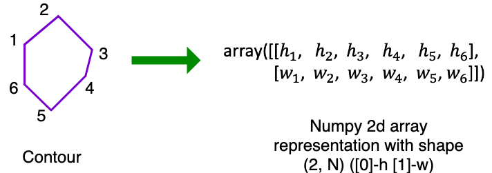

pycontour - Python contour toolkit
============
[](https://app.codacy.com/app/PingjunChen/pycontour?utm_source=github.com&utm_medium=referral&utm_content=PingjunChen/pycontour&utm_campaign=Badge_Grade_Dashboard)
[](https://circleci.com/gh/PingjunChen/pycontour)
[](https://pycontour.readthedocs.io/en/latest/?badge=latest)
[](https://badge.fury.io/py/pycontour)
[](https://www.paypal.me/PingjunChen)




Motivation
------------
Contour is one of the most important concept in plenty of image-based applications, mainly for the representation of region of interest (ROI), especially in medical imaging area. [OpenCV](http://opencv-python-tutroals.readthedocs.io/en/latest/py_tutorials/py_tutorials.html) and [shapely](http://shapely.readthedocs.io/en/stable/manual.html) both provide a few contour functionalities. However, the contour representation looks obscure and strange for developer.

This package tries to standardize the contour representation in python. Different from OpenCV, the contour here is represented as a numpy 2d array with shape 2*N (0-h 1-w), in which height always comes first, shown as the figure above. We believe this representation is the most intuitive way for developer to understand and use. Moreover, back and forth conversion between this representation with OpenCV or shapely are supported, enabling developers to take advantage of the functionalities of both OpenCV and shapely. We also add contour utilities, such as feature extraction, statistic metric calculation, and mask construction etc. to simplify contour usage. If you find [pycontour](https://github.com/PingjunChen/pycontour) to be helpful for your work, please `star` this repo.

Installation
------------
To install pycontour, libgeos need to install in advance. Other required packages can refer to requirements.txt.
```bash
sudo apt-get install libgeos-dev
# install relied packages
pip install shapely==1.6.4
pip install opencv-python==3.4.4.19
pip install scikit-image==0.14.1
pip install mahotas==1.4.5
# install pycontour
pip install pycontour==1.3.5
```

Usage example
------------

### Transformations
```python
import numpy as np
# with OpenCV Representation
from pycontour.cv2_transform import cv_cnt_to_np_arr, np_arr_to_cv_cnt
np_arr1 = np.array([[1, 0, 2, 3, 5, 4], [0, 2, 4, 3, 1, 0]])
cv_cnt = np_arr_to_cv_cnt(np_arr1)
np_arr2 = cv_cnt_to_np_arr(cv_cnt)
assert np.array_equal(np_arr1, np_arr2), "Back and forth transformation not equal"
# with Shapely Polygon
from pycontour.poly_transform import np_arr_to_poly, poly_to_np_arr
np_arr1 = np.array([[1, 0, 2, 3, 5, 4], [0, 2, 4, 3, 1, 0]])
poly = np_arr_to_poly(np_arr1)
np_arr2 = poly_to_np_arr(poly)
assert np.array_equal(np_arr1, np_arr2), "Back and forth transformation not equal"
# with Point List
from pycontour.coor_transform import point_list_to_np_arr, np_arr_to_point_list
np_arr1 = np.array([[1, 0, 2, 3, 5, 4], [0, 2, 4, 3, 1, 0]])
point_list = np_arr_to_point_list(np_arr1)
np_arr2 = point_list_to_np_arr(point_list)
assert np.array_equal(np_arr1, np_arr2), "Back and forth transformation not equal"
```

### Images
```python
import numpy as np
from pycontour.img import build_cnt_mask

np_arr1 = np.array([[1, 0, 2, 3, 5, 4], [0, 2, 4, 3, 1, 0]])
mask = build_cnt_mask(np_arr1)
```

### Features
```python
import numpy as np
from pycontour.fea import ZernikeMoments

np_arr1 = np.array([[1, 0, 2, 3, 5, 4], [0, 2, 4, 3, 1, 0]])
zernike_desc = ZernikeMoments(radius=21)
cnt_fea = zernike_desc.cal_fea(np_arr1)
assert len(cnt_fea) == 25, "Feature error"
```

Documentation
------------
Hosted in [https://pycontour.readthedocs.io](https://pycontour.readthedocs.io), powered by [readthedocs](https://readthedocs.org) and
[Sphinx](http://www.sphinx-doc.org).

Contributing
------------
``pycontour`` is an open source project and anyone is welcome to contribute. An easy way to get started is by suggesting a new enhancement on the [Issues](https://github.com/PingjunChen/pycontour/issues). If you have found a bug, then either report this through [Issues](https://github.com/PingjunChen/pycontour/issues), or even better, make a fork of the repository, fix the bug and then create a [Pull Request](https://github.com/PingjunChen/pycontour/pulls) to get the fix into the master branch.

Contributors
------------
See the [AUTHORS.md](AUTHORS.md) file for a complete list of contributors to the project.

License
------------
``pycontour`` is free software made available under the MIT License. For details see the [LICENSE](LICENSE) file.
