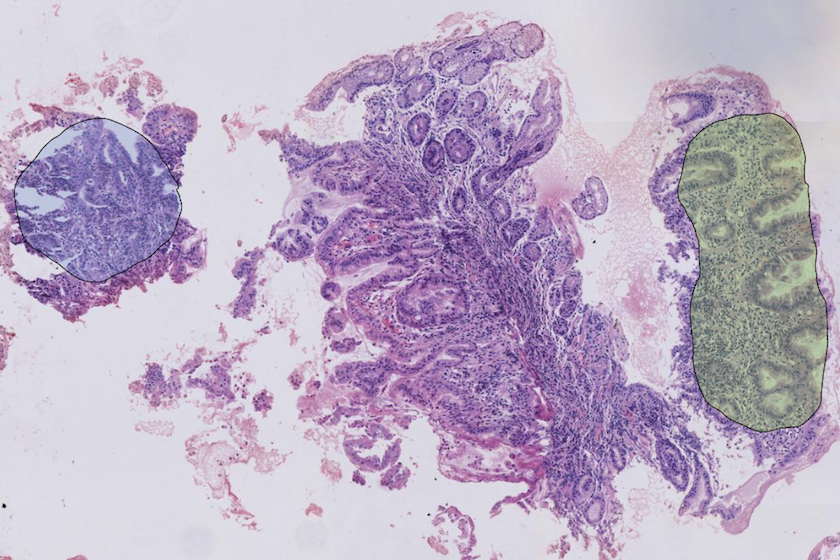

# **pycontour - Contour operation utilities**




## Origin
Contour is one of the most important concept in plentiful image-based applications, especially in medical imaging field, mainly for region of interest (ROI). [OpenCV](http://opencv-python-tutroals.readthedocs.io/en/latest/py_tutorials/py_tutorials.html) and [shapely](http://shapely.readthedocs.io/en/stable/manual.html) both provide a few contour operation support. This package tries to simplify the usage of contour operation, with numpy as the fundamental representation for contour.


## Installation
To install pycontour, libgeos and shapely need to install in advance. Other required packages can refer requirements.txt.
```
$ sudo apt-get install libgeos-dev
$ pip install shapely
$ pip install pycontour
```


## Documentation
* Hosted in [https://pycontour.readthedocs.io](https://pycontour.readthedocs.io), powered by [readthedocs](https://readthedocs.org) and
[Sphinx](http://www.sphinx-doc.org).
