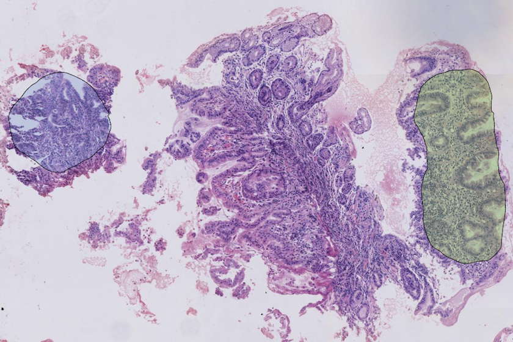

# **pycontour - Contour operation utilities**
<!-- Contour operation utilities, using numpy array as fundamental representation. -->



## Origin
Contour is one of the most important concept in plentiful image-based applications, especially in medical imaging field, mainly for region of interest (ROI). [OpenCV](http://opencv-python-tutroals.readthedocs.io/en/latest/py_tutorials/py_tutorials.html) and [shapely](http://shapely.readthedocs.io/en/stable/manual.html) both provide a few contour operation support. This package tries to simplify the usage of contour operation, with numpy as the fundamental representation for contour.

## Installation
To install pycontour, simple use pip
```
$ pip install pycontour
```
Required packages can refer requirements.txt.

## Main features
To appear...


## Documentation
To appear...
